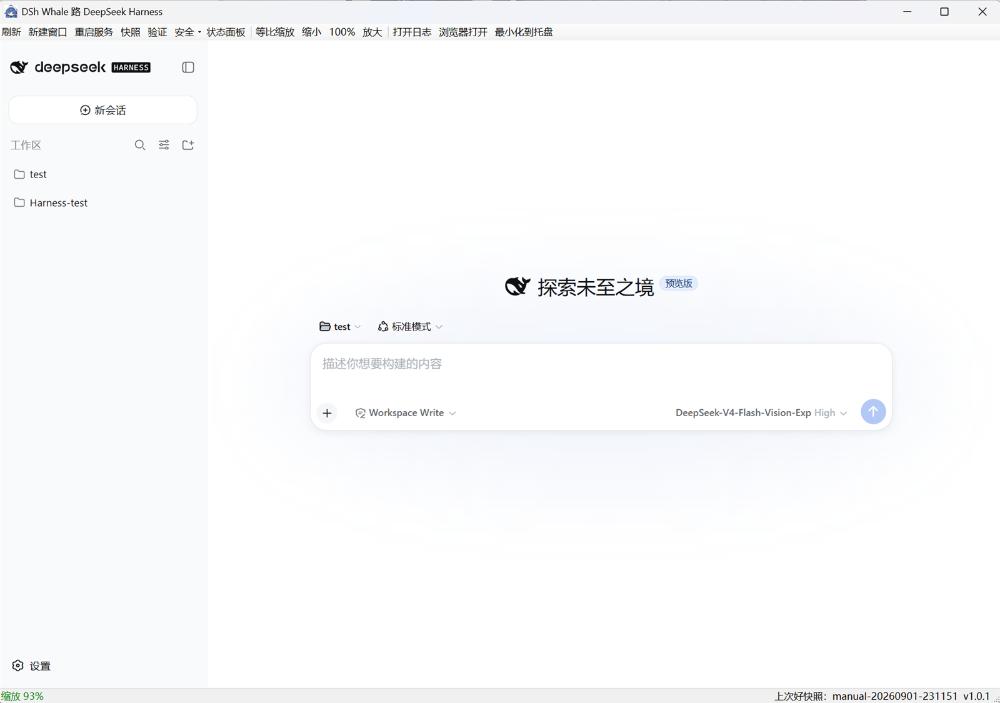
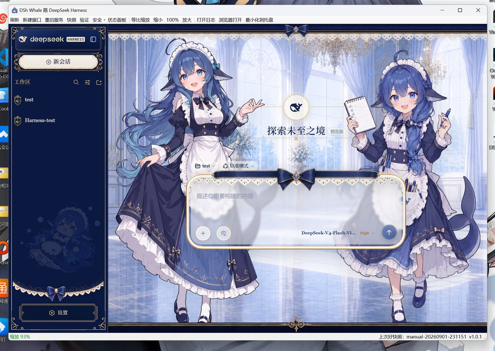

# DSh Whale · DeepSeek Harness 桌面启动器

> **当前版本 v1.0.1** · 修改与优化见 [CHANGELOG.md](CHANGELOG.md)

把 DeepSeek Harness 的 Web 版（`dsh --profile web`，默认 `http://127.0.0.1:3080`）封装成桌面应用：内嵌网页窗口、实时日志、托盘、插件安全监控、等比缩放与自动更新检查。

---

## 运行展示

**默认主题**



**鲸鱼娘主题（深海女仆工坊）**



---

## 特性

- **内嵌 Web 窗口**：基于 WebView2，直接渲染 DSH Web 界面，不另开浏览器。
- **高 DPI 清晰 + 等比缩放**：Per-Monitor-V2 感知不发虚；默认按窗口宽度等比缩放，可手动 缩小/100%/放大，也支持 `Ctrl+滚轮`、`Ctrl ±`。
- **实时日志**：dsh 服务的 stdout/stderr 逐行写入 `logs\dsh-web-<时间戳>.log`。
- **托盘 + 单实例**：最小化到托盘；重复打开只保留一个图标，并唤醒已运行窗口。
- **多开（新建窗口）**：同一进程内可新开多个 DSH Web 窗口，仍只占一个托盘图标。
- **插件安全监控**：装插件前自动快照；服务在插件加载后崩溃则自动回滚并重启；重启后健康则自验证。
- **安全面板**：查看服务健康、上次好快照、待验证插件与快照列表，可新建快照/回滚/验证/打开日志。
- **通知 + 自动更新**：服务就绪、崩溃回滚、版本更新等弹系统通知；启动时检查 GitHub Release，发现新版本可提示打开。

---

## 目录结构

```
dsh-desktop\
├─ bin\Dwhale.exe              ← 应用（build.ps1 生成，不提交）
├─ bin\dps.ico                 ← 应用图标
├─ bin\Microsoft.Web.WebView2.*.dll, WebView2Loader.dll   ← WebView2 SDK（build.ps1 放置）
├─ config.json                 ← 本机配置（install-shortcut.ps1 生成，不提交）
├─ config.sample.json          ← 配置模板
├─ dsh-safe-add.cmd            ← 安全装插件入口
├─ LICENSE                     ← MIT
├─ CHANGELOG.md                ← 版本变更记录
├─ docs\                       ← 运行展示截图
├─ logs\                       ← 实时日志（运行期生成）
├─ state\                      ← 快照与 manifest（运行期生成）
├─ scripts\
│  ├─ install-shortcut.ps1     ← 生成本机 config.json + 桌面快捷方式
│  ├─ build.ps1                ← 用 csc 编译 exe（自动寻找 WebView2 SDK）
│  ├─ dsh-safety.ps1           ← 安全模块（Snapshot/Add/Rollback/Verify/Status/Monitor）
│  └─ convert-icon.ps1         ← PNG→ICO 转换
└─ src\Dwhale.cs, MainForm.cs, WebWindow.cs   ← C# 源码
```

路径均按脚本所在位置推导，换目录或换机器只需重跑一次 `install-shortcut.ps1`。

---

## 安装

1. 前置：Node.js、pnpm、.NET Framework 4.x、WebView2 运行时（Windows 10/11 一般自带）。
2. （可选）构建 exe：
   ```powershell
   powershell -NoProfile -ExecutionPolicy Bypass -File scripts\build.ps1
   ```
   `build.ps1` 自动寻找 WebView2 SDK（优先 `lib\webview2\`，其次 `bin\`，再尝试 Office 内置位置）。网络可用时可 `dotnet add package Microsoft.Web.WebView2` 后把三个 DLL 放入 `lib\webview2\`。
3. 生成本机配置与桌面快捷方式：
   ```powershell
   powershell -NoProfile -ExecutionPolicy Bypass -File scripts\install-shortcut.ps1
   ```
   桌面出现 `DSh Web 鲸鱼娘.lnk`，双击即用。只想生成配置用 `-NoShortcut`；只看结果用 `-DryRun`。

---

## 使用

双击快捷方式即启动，窗口内即 DSH Web 界面。工具栏：新建窗口 / 刷新 / 重启服务 / 快照 / 验证 / 安全（回滚）/ 状态面板 / 打开日志 / 浏览器打开 / 最小化到托盘。关闭窗口默认最小化到托盘，从托盘「退出」才真正退出并停止服务。

### 安全装插件（先快照）

```powershell
# 方式 A（推荐）
.\dsh-safe-add.cmd "github:Small-tailqwq/dsh-deep-whale#path:/skin-manager"

# 方式 B
powershell -NoProfile -ExecutionPolicy Bypass -File scripts\dsh-safety.ps1 `
  -Action Add -Plugin "github:Small-tailqwq/dsh-deep-whale#path:/skin-manager" -Config config.json
```

流程：拍快照 → `dsh plugin --profile web add <插件>` → 标记待验证 → 重启。重启后用「重启服务」或面板「验证」；若服务崩溃则自动回滚到装插件前的快照。

### 常用命令

| 用途 | 命令 |
|---|---|
| 查看状态/健康 | `dsh-safety.ps1 -Action Status` |
| 新建基准快照 | `dsh-safety.ps1 -Action Snapshot -Reason baseline` |
| 验证并提升为 good | `dsh-safety.ps1 -Action Verify` |
| 回滚 | `dsh-safety.ps1 -Action Rollback -Snapshot <id\|lastgood>` |
| 独立监控 | `dsh-safety.ps1 -Action Monitor` |

---

## 配置 `config.json`

由 `install-shortcut.ps1` 生成，字段见 `config.sample.json`。

- `nodePath` / `dshBinJs`：Node 与 dsh 的 bin.js 路径。
- `dshHome` / `webProfile` / `webHost` / `webPort`：DSH 数据目录与 web profile（默认 `127.0.0.1:3080`）。
- `logDir` / `stateDir` / `snapshotDir` / `manifestPath` / `safetyScript` / `iconPath`：各资源位置。
- `updateUrl`：GitHub Release API 地址，留空则关闭自动更新。
- `appVersion`：当前版本，用于与远端版本比较。

> `config.json` 含本机绝对路径，不要提交；提交 `config.sample.json`。

---

## 注意事项

- 写入真实的 `%USERPROFILE%\.dsh`（默认 `DSH_HOME`）。回滚会还原 `~/.dsh/profiles/web\package.json`、`pnpm-lock.yaml`、`cordis.patch.yml` 与 `~/.dsh\cordis.patch.yml`。
- 首次装新插件包需重启一次 DSH（新增/删除包才重启；切皮肤/换配置走热重载）。
- WebView2 需要运行时；若内嵌窗口初始化失败，状态栏会提示，此时可用「浏览器打开」。
